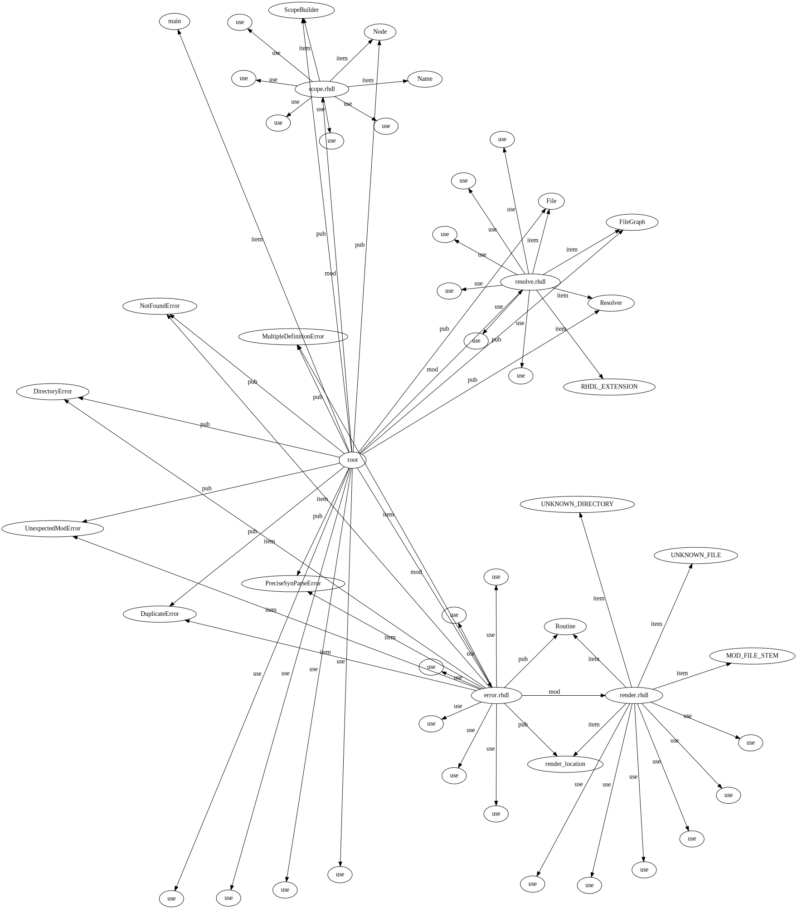

# Rust Hardware Design Language (RHDL)

 [](https://codecov.io/gh/rhdl/rhdlc)

An experiment in using Rust syntax to describe hardware.

## Motivation

Advance the current state of the art for writing code targeting programmable hardware with:

* Batteries included
   * Formatting with [rustfmt](https://github.com/rust-lang/rustfmt)
   * Documentation with [doc comments](https://doc.rust-lang.org/stable/rust-by-example/meta/doc.html)
   * Libraries with [crates](https://doc.rust-lang.org/book/ch07-01-packages-and-crates.html)
   * Community crates with [crates.io](https://crates.io/)
* Additional compile time functionality
    * [Macros](https://doc.rust-lang.org/rust-by-example/macros.html) for reduced repetition
        * i.e. `include_bytes!("FTDI_245.rom")` lets you include a ROM from a file in the same directory
        * Eliminates need for auxiliary scripting languages like Tcl, Perl or Python
    * [SMT](https://en.wikipedia.org/wiki/Satisfiability_modulo_theories) prover for finding desired logic
        * i.e. in a [gray code](https://en.wikipedia.org/wiki/Gray_code), the encoding for each adjacent number differs by a single bit
            * instead of finding a gray code, mathematically define what you want and let the prover find an instance satisfying the requirements
* Verification
    * Use SMT provers to verify linear temporal logic statements about a system
         * Can verify the system will never enter an unsafe state for safety-critical applications
         * No need for test vectors
    * Test vector fuzzing with [AFL](https://github.com/rust-fuzz/afl.rs)
* Simulation as a first-class citizen
    * Compile to rust code for simulation that runs circles around [ModelSim](https://en.wikipedia.org/wiki/ModelSim) and others
    * [Modelica](https://en.wikipedia.org/wiki/Modelica) for transistor-level simulation in different environmental conditions
    * code coverage included
* Synthesis as a first-class citizen
    * RHDL directly to a bitstream on open-source or reverse-engineered FPGAs
    * Offer [hdlmake](https://ohwr.org/projects/hdl-make)-style tooling for proprietary tech like Intel FPGAs


Put an end to:

* Closed-source tooling
    * Impossible to vet for mission-critical applications
    * Paid contracts/plans for support (what is this, 2005?)
    * "Premium" features
* Multi-hour (or even multi-day) simulations for large designs

## rhdlc

The compiler for RHDL that finds errors/warnings before transpiling to the target language or doing direct synthesis.

### Concepts

#### File Finder

Finds code for modules in separate files from the top-level module.

#### Resolver

Builds a scope tree and checks it for scope-related errors, like missing types, duplicate names, bad imports, bad pubs, etc.

The scope tree of `rhdlc` itself:



#### Type Checker (TODO)

WIP

#### VHDL IR

Use VHDL as an intermediate representation, since it is strongly typed and thus it's easier to avoid ambiguity-related synthesis errors.

## rhdl "standard library"

WIP

## Development

### Examining and overwriting test regressions

Make sure you've already built with `cargo build`. To look at changes for compile fail use resolution tests:

```bash
for i in test/compile-fail/resolution/use/*; do clear; ./target/debug/rhdlc ./$i/*.rhdl 2>&1 | diff -wrt --color=auto $i/expected.txt -; echo $i; read proceed; [ "$proceed" == "y" ] && ./target/debug/rhdlc ./$i/*.rhdl 2>$i/expected.txt; done
```


### Fuzzing


Install fuzzer:

```
cargo install afl
```

Seed fuzzer with tests:

```
for i in `find test/ -type f -name '*rhdl'`; do cp $i fuzz/$(echo $i | sed 's|/|-|g'); done
```

Run fuzzer:

```
cargo afl fuzz -i fuzz -o fuzz_state/ target/debug/rhdlc
```
